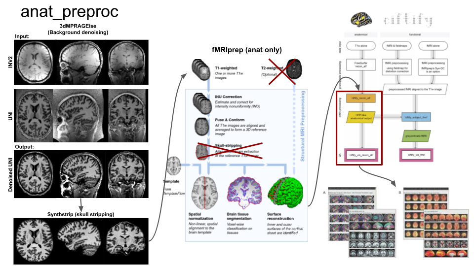

anat_preproc
============

Snakebids pipeline for anatomical preprocessing with [3dMPRAGEise](10.5281/zenodo.4626825), [synthstrip](https://doi.org/10.1016/j.neuroimage.2022.119474), [fMRIPrep](https://doi.org/10.1038/s41592-018-0235-4) and [ciftify](https://doi.org/10.5281/zenodo.2586104).



Inputs
=======

- Bids dataset with:
  - MP2RAGE data (uni and inv2)
  - T2w (currently doesn't work)
  - *Note*: it is recommended that inputed data is gradient distortion and B1 field corrected)
  
- dependencies:
  - python:
    - snakebids: https://github.com/akhanf/snakebids
  - singularity containers:
    - AFNI: https://hub.docker.com/r/afni/afni_make_build
    - Ciftify: https://hub.docker.com/r/tigrlab/fmriprep_ciftify
    - fMRIPrep: https://hub.docker.com/r/nipreps/fmriprep/
    - synthstrip: https://hub.docker.com/r/freesurfer/synthstrip
  
Usage
======
1. Create and activate virtual environment minimum python version >= 3.7 and install snakebids version == 0.6.2

   - on Compute Canada: 
  
  ```
  module load python/3.8
  virtualenv --no-download your_virtual_env_name_here
  source your_virtual_env_name_here/bin/activate
  pip install snakebids==0.6.2

  ```
2. Change directory to `anat_preproc/anat_preproc` (to be in same directory as `run.py` file).
   - `cd anat_preproc/anat_preproc`
   
3. Use below listed run options to run pipeline. 
   - Skipping gradient distortion correction:
  `python run.py bids_dir out_dir participant`

   - running  gradient correction:  `python run.py bids_dir out_dir participant --grad_coef your_grad_coef_file.grad`
  
   - on Compute Canada you can use https://github.com/khanlab/cc-slurm to submit jobs with SLURM.   `python run.py bids_dir out_dir participant --grad_coef your_grad_coef_file.grad --profile cc-slurm`
  
   - **NOTE**: you are likely going to have to specify inv2 and uni file paths with wildcards in your command given your dataset specific naming conventions.
     - example:
        ```
        python run.py /scratch/myousif9/snsx_inprogress/sourcedata/SNSX_7T/tar2bids_v0.0.5e/bids/ /scratch/myousif9/snsx_inprogress/output/anat_preproc_gradient_corr_test participant --path-uni /scratch/myousif9/snsx_inprogress/sourcedata/SNSX_7T/tar2bids_v0.0.5e/bids/sub-{subject}/anat/sub-{subject}_acq-UNI_run-01_MP2RAGE.nii.gz --path-inv2 /scratch/myousif9/snsx_inprogress/sourcedata/SNSX_7T/tar2bids_v0.0.5e/bids/sub-{subject}/anat/sub-{subject}_inv-2_run-01_MP2RAGE.nii.gz --participant_label C001 --grad_coef /project/ctb-akhanf/myousif9/gradcorrect_ref_file/coeff_AC84.grad --profile cc-slurm
        ```

### run options:
 ```
(snakemake) [myousif9@gra-login2 anat_preproc]$ python run.py -h
usage: run.py [-h] [--pybidsdb-dir PYBIDSDB_DIR] [--reset-db] [--force-output]
              [--help-snakemake]
              [--participant-label PARTICIPANT_LABEL [PARTICIPANT_LABEL ...]]
              [--exclude_participant_label EXCLUDE_PARTICIPANT_LABEL [EXCLUDE_PARTICIPANT_LABEL ...]]
              [--derivatives DERIVATIVES [DERIVATIVES ...]]
              [--fs_license FS_LICENSE] [--grad_coef GRAD_COEF]
              [--filter-uni FILTER_UNI [FILTER_UNI ...]]
              [--filter-inv2 FILTER_INV2 [FILTER_INV2 ...]]
              [--wildcards-uni WILDCARDS_UNI [WILDCARDS_UNI ...]]
              [--wildcards-inv2 WILDCARDS_INV2 [WILDCARDS_INV2 ...]]
              [--path-uni PATH_UNI] [--path-inv2 PATH_INV2]
              bids_dir output_dir {participant}

Snakebids helps build BIDS Apps with Snakemake

optional arguments:
  -h, --help            show this help message and exit

STANDARD:
  Standard options for all snakebids apps

  --pybidsdb-dir PYBIDSDB_DIR, --pybidsdb_dir PYBIDSDB_DIR
                        Optional path to directory of SQLite databasefile for
                        PyBIDS. If directory is passed and folder exists,
                        indexing is skipped. If reset_db is called, indexing
                        will persist
  --reset-db, --reset_db
                        Reindex existing PyBIDS SQLite database
  --force-output, --force_output
                        Force output in a new directory that already has
                        contents
  --help-snakemake, --help_snakemake
                        Options to Snakemake can also be passed directly at
                        the command-line, use this to print Snakemake usage

SNAKEBIDS:
  Options for snakebids app

  bids_dir              The directory with the input dataset formatted
                        according to the BIDS standard.
  output_dir            The directory where the output files should be stored.
                        If you are running group level analysis this folder
                        should be prepopulated with the results of the
                        participant level analysis.
  {participant}         Level of the analysis that will be performed.
  --participant-label PARTICIPANT_LABEL [PARTICIPANT_LABEL ...], --participant_label PARTICIPANT_LABEL [PARTICIPANT_LABEL ...]
                        The label(s) of the participant(s) that should be
                        analyzed. The label corresponds to
                        sub-<participant_label> from the BIDS spec (so it does
                        not include "sub-"). If this parameter is not provided
                        all subjects should be analyzed. Multiple participants
                        can be specified with a space separated list.
  --exclude_participant_label EXCLUDE_PARTICIPANT_LABEL [EXCLUDE_PARTICIPANT_LABEL ...], --exclude-participant-label EXCLUDE_PARTICIPANT_LABEL [EXCLUDE_PARTICIPANT_LABEL ...]
                        The label(s) of the participant(s) that should be
                        excluded. The label corresponds to
                        sub-<participant_label> from the BIDS spec (so it does
                        not include "sub-"). If this parameter is not provided
                        all subjects should be analyzed. Multiple participants
                        can be specified with a space separated list.
  --derivatives DERIVATIVES [DERIVATIVES ...]
                        Path(s) to a derivatives dataset, for folder(s) that
                        contains multiple derivatives datasets (default:
                        False)
  --fs_license FS_LICENSE, --fs-license FS_LICENSE
                        Provide path to freesurfer license text file.
  --grad_coef GRAD_COEF, --grad-coef GRAD_COEF
                        Provide path to gradient correction coefficient file.
                        Gradient correction dis skipped if file is not
                        specified.

BIDS FILTERS:
  Filters to customize PyBIDS get() as key=value pairs

  --filter-uni FILTER_UNI [FILTER_UNI ...], --filter_uni FILTER_UNI [FILTER_UNI ...]
                        (default: suffix=MP2RAGE extension=.nii.gz
                        datatype=anat acquisition=UNI invalid_filters=allow
                        echo=None)
  --filter-inv2 FILTER_INV2 [FILTER_INV2 ...], --filter_inv2 FILTER_INV2 [FILTER_INV2 ...]
                        (default: suffix=MP2RAGE extension=.nii.gz
                        datatype=anat inv=2 invalid_filters=allow echo=None)

INPUT WILDCARDS:
  File path entities to use as wildcards in snakemake

  --wildcards-uni WILDCARDS_UNI [WILDCARDS_UNI ...], --wildcards_uni WILDCARDS_UNI [WILDCARDS_UNI ...]
                        (default: subject session acquisition task run)
  --wildcards-inv2 WILDCARDS_INV2 [WILDCARDS_INV2 ...], --wildcards_inv2 WILDCARDS_INV2 [WILDCARDS_INV2 ...]
                        (default: subject session acquisition task run)

PATH OVERRIDE:
  Options for overriding BIDS by specifying absolute paths that include
  wildcards, e.g.: /path/to/my_data/{subject}/t1.nii.gz

  --path-uni PATH_UNI, --path_uni PATH_UNI
  --path-inv2 PATH_INV2, --path_inv2 PATH_INV2
 ```
  Outputs
  ========
  *Will be added soon.*

  Citations
  =========
  ### gradcorrect
  https://github.com/khanlab/gradcorrect
  ### 3dMPRAGEise:
  Sriranga Kashyap. (2021). srikash/3dMPRAGEise: ondu (1.0). Zenodo. https://doi.org/10.5281/zenodo.4626825
  ### SynthStrip:
  Hoopes A, Mora JS, Dalca AV, Fischl B, Hoffmann M. SynthStrip: skull-stripping for any brain image. Neuroimage. 2022 Oct 15;260:119474. doi: 10.1016/j.neuroimage.2022.119474. Epub 2022 Jul 13. PMID: 35842095; PMCID: PMC9465771.
  ### Freesurfer:
  Fischl B. FreeSurfer. Neuroimage. 2012 Aug 15;62(2):774-81. doi: 10.1016/j.neuroimage.2012.01.021. Epub 2012 Jan 10. PMID: 22248573; PMCID: PMC3685476.

  ### fMRIPrep:
  Esteban O, Markiewicz CJ, Blair RW, Moodie CA, Isik AI, Erramuzpe A, Kent JD, Goncalves M, DuPre E, Snyder M, Oya H, Ghosh SS, Wright J, Durnez J, Poldrack RA, Gorgolewski KJ. fMRIPrep: a robust preprocessing pipeline for functional MRI. Nat Methods. 2019 Jan;16(1):111-116. doi: 10.1038/s41592-018-0235-4. Epub 2018 Dec 10. PMID: 30532080; PMCID: PMC6319393.

  ### Ciftify
  Dickie EW, Anticevic A, Smith DE, Coalson TS, Manogaran M, Calarco N, Viviano JD, Glasser MF, Van Essen DC, Voineskos AN. Ciftify: A framework for surface-based analysis of legacy MR acquisitions. Neuroimage. 2019 Aug 15;197:818-826. doi: 10.1016/j.neuroimage.2019.04.078. Epub 2019 May 12. PMID: 31091476; PMCID: PMC6675413.
